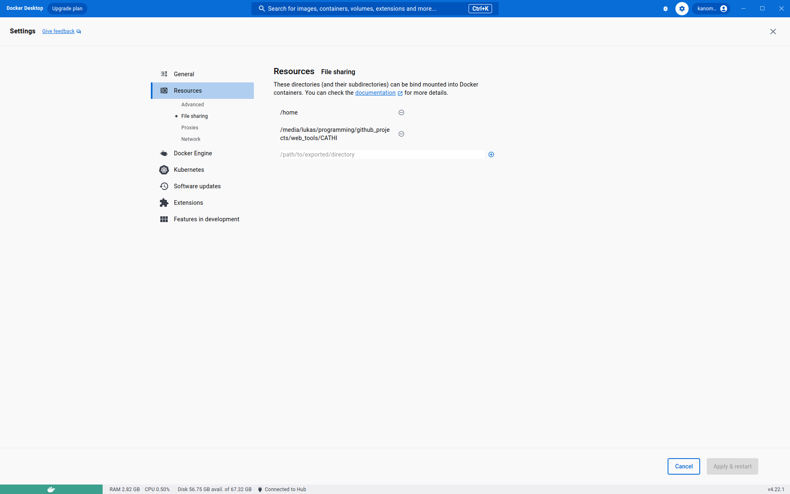
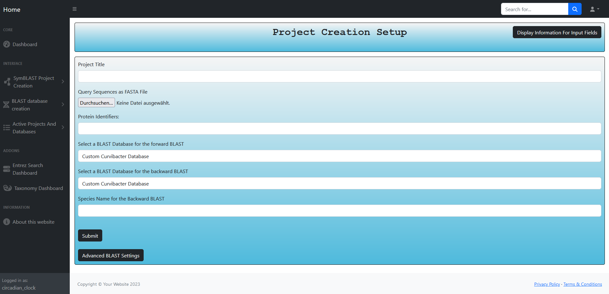
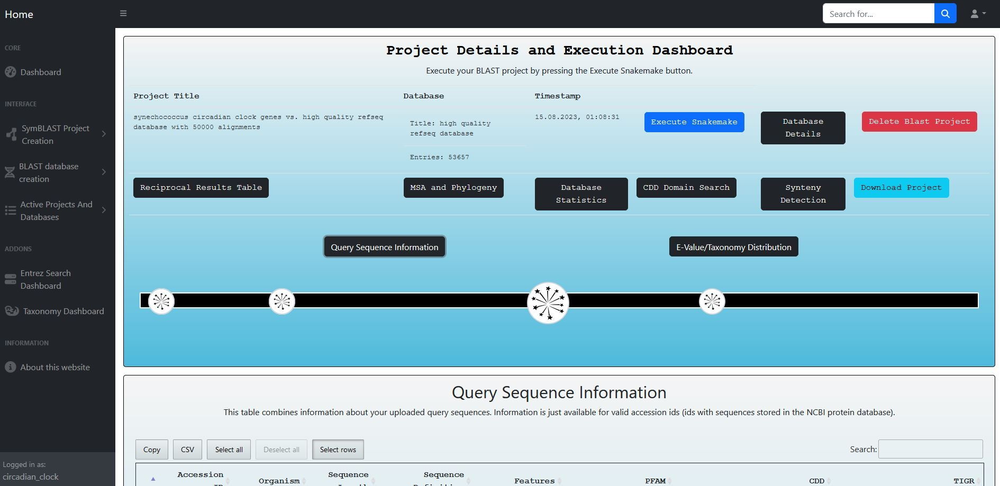
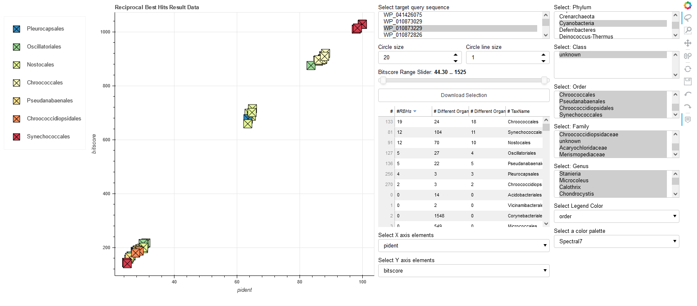

# CATHI - An interactive platform for comparative genomics and homolog identification

Symmetrical BLAST and target sequence search web interface with Django, Gunicorn, Ngninx, PostgreSQL, Celery, RabbitMQ, 
E-Direct, BLAST, Snakemake and Miniconda.

CATHI is a user-friendly bioinformatics tool that performs reciprocal BLAST searches, generates multiple sequence 
alignments, and builds phylogenetic trees. It is integrated with the workflow management system snakemake, providing a 
streamlined and efficient way to manage the entire bioinformatics pipeline. 
Furthermore, CATHI offers additional features that make it a powerful and flexible solution
for researchers across various fields. CATHI generates interactive plots and tables in standalone HTML documents, 
which enables users to visualize and analyze complex biological data easily. CATHI integrates the ``entrez`` tool, 
which allows for sequence and paper searches directly within the web interface. It also enables users to download 
taxonomic-specific protein sequences based on the results of their ``entrez`` searches. 

In addition, CATHI includes tools for managing local protein BLAST databases. Researchers can download and format custom 
databases, providing greater control and flexibility over the data used in their analyses. CATHI also includes 
a refined alignment and phylogenetic tree reconstruction process that leverages the protein domains of the CDD 
database using the RPS-BLAST tool. 

CATHI is highly sophisticated and powerful, offering a range of features and capabilities ideal for target sequence searches.
It enables performing reciprocal and one-way BLAST searches within local and remote 
databases, providing valuable insights into the evolutionary relationships and functional characteristics of sequences.
CATHI's integration into a docker container network streamlines its installation process. 
Overall, CATHI is a flexible and intuitive solution that can help researchers achieve their research goals.

## Content
- [Installation](#installation)
- [Container network and configuration](#configuration_notes)
- [How To Use CATHI](#project_setup)
- [BLAST Database creation](#blast_database)
- [Upload your own genome files](#genome_upload)
- [Technical Details](#technical_details)
  - [Notes on the download procedure](#download_process)
  - [Notes on the BLAST database formatting procedure](#makeblastdb)
- [ToDo's](#todo)

<a name="installation"></a>
## Installation

### Installation of docker-desktop
The only requirement for installation is a local Docker-Desktop installation, which you can download under the following 
link: [docker-desktop](https://www.docker.com/products/docker-desktop/).

If you are working on a UNIX machine, you may need to enable file sharing. Therefore, open your docker-desktop
application and switch to the Settings tab. Open the settings page and add the path to CATHI on the File Sharing tab in the 
Resources section (see following image).



### Installation of CATHI
Download and decompress this repository via the `Download ZIP` button of the `<> Code` tab or with `git clone git@github.com:Kanomble/celery_blast.git`.
Open a terminal and use the `cd` command to point to the local version of the CATHI project repository (e.g., if you have downloaded and decompressed CATHI
in the directory: `C:\Users\Test\Documents\CATHI`, open your powershell and execute the command `cd "C:\Users\Test\Documents\CATHI"`.
Use the `ls` command to confirm that your terminal/powershell points to the correct directory, the output of `ls` should include following files and directories:
`celery_blast  data  docker-compose-production.yml  docker-compose.yml  Dockerfile  LICENSE  nginx  README.md  requirements.txt  tmp`.

```` Bash
git clone git@github.com:Kanomble/celery_blast.git
cd celery_blast
docker compose up
````

The application can get installed by submitting the `docker-compose up` or `docker compose up` command in a terminal window,
which points to the applications working directory (directory with `docker-compose.yml`). 
The docker client will pull remotely available images, including the base image for this application,
an image for the PostgreSQL database and finally an image for the RabbitMQ message broker.
Docker images are pulled from this [DockerHub](https://hub.docker.com/repository/docker/kanomble/rec_blast_base_image).
All required software tools are loaded and installed automatically, there is no need for other third party software.
The installation procedure can take up to 30 minutes, depending on your available RAM and internet connection. 
During installation process, a local copy of the CDD database is downloaded.
It is recommended to install the application with the remotely available images and the `docker compose up` command. 

## Advanced Installation

It is possible to build the necessary images from the Dockerfile of this repository. You can change and adapt the dockerfile according to the software 
tools you need, keep in mind to adapt the `docker-compose.yml` or the `docker-compose-production.yml` files if you want to use local Docker images of this tool.

Docker creates seven containers named: `celery_blast_X_1` where `X` is a synonym for 
`nginx, worker, flower, web, postgres and rabbitmq`.

<a name="configuration_notes"></a>
### Notes on CATHI containers and possible configurations
CATHI is a server site tool, by starting the container network, your local computer will be used as a web
server. `Django` is the underlying web-framework and `gunicorn` serves as the WSGI HTTP Server. Both applications reside
in the CATHI base image. `Nginx` is used as a reverse proxy server, it directs client requests to `gunicorn`.
The long-running background tasks are managed by `rabbitmq` and `celery`, thus triggered processes are picked up by 
the message broker `rabbitmq` and passed to a queue, if a `celery-worker` is free, the process is executed. The task progress
is saved within the `postgresql` database within the `django_celery_results_taskresult` table, which enables task monitoring.
The `flower` container can be used to monitor the `celery-worker`. The reciprocal BLAST pipeline and the normal 
one-way BLAST pipelines are integrated into a Snakefile, which is used by the workflow management system `snakemake`.
Customization of Snakefiles enables user defined post-processing. In addtion, a `jupyter-notebook` container is 
integrated into the CATHI container network. Configuration is done within the `.env.prod` file. 
All important environment variables are defined within this file 
(e.g. the `DJANGO_ALLOWED_HOSTS` and the `SECRET_KEY` variables).

<a name="project_setup"></a>
## Project setup
To execute the integrated reciprocal BLAST pipeline of CATHI, certain data must be set up by the user. 
This includes the query sequences from a particular organism/genome file,
a forward BLAST database that will serve as the search space, a backward BLAST database, the scientific name of the 
organism from which the query sequences were obtained, and a project title. Additionally, the user can modify some BLAST
settings, such as the number of output sequences per query sequence (num_alignments) or the e-value cut-off. 
The BLAST databases can be selected from a special drop-down menu.

The forward BLAST database acts as a search space in which putative orthologous sequences can be located, 
while the backward BLAST database must contain the genome file from which the query sequences were obtained. 
Prior to saving a project into the database or executing the pipeline, the user-provided data undergoes validation to 
ensure that it meets the necessary criteria. If any of the validations fail,
accurate error messages are displayed within the relevant form fields to ensure a smooth pipeline execution.




The pipeline comprises the following steps:

1. Forward BLAST (default BLAST settings: e-value=0.001, word-size=3, threads=1, num_alignments=10000, max_hsps=500)
2. Backward BLAST preparation (extracting homologous target sequences of the forward BLAST)
3. Backward BLAST (BLAST search of the homologous target sequences against the genome of the query sequences)
4. Extracting Reciprocal Best Hits (RBHs, this is done via pandas merging tools)
5. Post-processing of RBHs (inference of taxonomic information, statistics, HTML and CSV tables, basic result plots)
6. Extraction of RBH-sequences separated by query sequences
7. Multiple sequence alignment of each set of RBHs with MAFFT
8. Phylogenetic inference of each set of RBHs with FastTree
9. Post-processing of the phylogenetic tree with ete3
10. CDD domain search of target sequences



Further CATHI post-processing procedures outside the scope of this pipeline involves:

1. Combining taxonomic information of the underlying database with the RBH result table
2. Building an interactive bokeh plot, that enables intuitive result interpretation
   1. Filter RBHs based on taxonomy, e-value, bitscore, sequence length and percent identity
   2. Download a selection of protein identifier
3. Refined phylogenetic inference with CDD domains of the RBHs
   1. Conducting RPS-BLAST with a specified set of RBHs
   2. Conducting a principal component analysis (PCA) based on the percent identity of the inferred domains with respect to the query sequence domains
   3. Building an interactive bokeh plot with the first two principal components and the taxonomic information within the RBH result table
   4. Refine the 

### CATHI example output


The X and Y axes of the scatter plot are parameters of the dataset, such as bitscore, e-value, sequence identity (pident), and sequence lengths, enabling the
exploration of relationships among these RBHs. The interactivity of the scatter plot is facilitated by Bokeh, a powerful
visualization library. Users can dynamically manipulate the dataset through filtering options informed by the
taxonomic information associated with each RBH. In addition, Bokeh provides a lasso tool to select specific RBHs
within the graph. The lasso tool can be selected from the Bokeh tool-panel displayed at the right side of the figure.
This interactive feature empowers researchers to dissect real-time taxonomic trends and relationships among RBHs,
unveiling underlying patterns and insights.

### Best practices for project settings
Use appropriate BLAST databases. If you want to search in more complete genomes, create a database that contains genome sequences
with a completeness level of `Chromosome` or `Complete Genome`. The `e-value` is more accurate for bigger databases, adjust the 
`e-value` according to your needs, this may have a huge effect on your inferred RBHs. Adjust the `num_alignments` parameter if
you work with huge databases, especially if you are working with more common sequences. 

The backward BLAST database should contain only one genome that corresponds to the taxonomic unit translated provided scientific name.


<a name="blast_database"></a>
## BLAST Databases
## BLAST database preparation from GenBank or RefSeq assemblies
First, you need to tell CATHI to download the refseq or genbank assembly summary file from the
refseq [FTP](ftp://ftp.ncbi.nih.gov/genomes/refseq/) or genbank [FTP](https://ftp.ncbi.nlm.nih.gov/genomes/genbank/) directories.
The application loads the processed entries of the summary file into a pandas dataframe, 
that is displayed in the BLAST database transaction dashboard after pressing the submit button. Possible BLAST database user specifications are
the level of assembly completeness (e.g. 'Complete Genome', 'Chromosome', 'Contig' and 'Scaffold') 
and (multiple) taxonomic information (e.g. 'Cnidaria, Mammalia').

### Example database creation
E.g. if you want to create a high quality database containing only species from the phylum `Cyanobacteriota`, you have to specify 
this during database creation. This can be done by typing `Cyanobacteriota` into the field "Scientific Names (sep. by ",")" and by
checking the assembly levels `Complete Genome` and `Chromosome`. 

If the user submits the form, a `BlastDatabase` model instance and a 
database directory, with a csv file containing the database table, is created.
The model is saved into the database, the database is not downloaded and formatted directly. 
The download and formatting procedure has to be started separately, which enables the user to validate database entries.
The download and format process progression is visualized on the database dashboard.
Available databases are shared between users.

<a name="genome_upload"></a>
## Uploading genomes for BLAST database creation
The second option to obtain BLAST databases is to upload your own genomes. 
Currently, only genomes with protein sequences are supported. There are two different forms that can be used 
for uploading your own genome files.
1. The first form allows uploading a concatenated genome FASTA files with 
metadata file fields such as a taxmap file, which holds taxonomic information, an organism file, an assembly level file and
an assembly accession file. Most of these files are not mandatory. 
2. The other form allows uploading of multiple, single genome files together with their valid scientific organism names.


<a name="technical_details"></a>
## Technical Details
### Docker
All necessary software packages are deployed within docker container. Those containers are wrapped into a network
using docker-compose.

### Django, Gunicorn and Nginx
Django, Gunicorn, and Nginx are commonly used technologies for building and deploying web applications. 
In a Docker network, these technologies can be used together to create a scalable and efficient web application stack.
Django is a popular Python-based web framework used for building web applications. 
Gunicorn is a Python WSGI HTTP server that can serve Django applications.
Nginx is a high-performance web server that can act as a reverse proxy, load balancer, and serve static files.
When using Django, Gunicorn, and Nginx in a Docker network, each technology can be run in a separate Docker container. 
The Django application can be run using Gunicorn as a WSGI HTTP server, while Nginx can be used as a reverse proxy to direct traffic to the appropriate container.
This setup can be scaled horizontally by adding more containers to handle increased traffic. 
In addition, Docker's networking features can be used to ensure that traffic is properly directed to the appropriate container.
Overall, using Django, Gunicorn, and Nginx in a Docker network can create a highly scalable and efficient web application stack.

### Distribution of background tasks with Celery
The open source tool celery is used to integrate a task queuing system within the django container. All background tasks are 
wrapped into celery tasks. Celery enables task distribution across threads which enables the simultaneous processing of various reciprocal or one-way BLAST
projects. The celery worker process is triggered in the `celery_worker` container, tasks can be monitored via dedicated web-interfaces or within this
container. Accurate log-messages are displayed within the terminal window of the `celery_worker` container. Celery tasks are saved 
in the `PostgreSQL` database by using the `TaskResult` model instance of the `django_celery_results` django application 
(installed via the python package `django-celery-results`). Detailed information about Celery can be found on the official 
[project documenation page](https://docs.celeryq.dev/en/stable/index.html).

### Snakemake pipeline
In order to enable reproducibility and an easy-to-use workflow execution, the workflow engine snakemake is used.
Snakemake associated snakefiles reside in a static directory `celery_blast/celery_blast/static/snakefiles`. 
They can be used outside this application, e.g. if the researcher needs to use additional settings or want to implement own post-processing procedures.
Different snakefiles are designed to execute the desired workflows. 
Currently, there are Snakefiles for the One-Way BLAST remote and local searches and the reciprocal BLAST analysis.
Execution of snakemake is wrapped in functions within the `tasks.py` files,
which are decorated with the celery `@shared_task` decorator. Those functions are queued up by rabbitmq and are processed by the celery worker.
Snakemake is executed with the `subprocess.Popen` interface which spawns a child process for every Snakemake workflow. 
Snakemake's working directory is the current project directory, e.g. if you executed the snakemake pipeline for a reciprocal BLAST
project, the `CWD` of snakemake is the path that points to this project. Default project paths are defined in the `celery_blast/settings.py` file.

Detailed information about Snakemake can be found on the [project documentation page](https://snakemake.readthedocs.io/en/stable/).

### PostgreSQL database models
Django models reside inside project specific `models.py` files. Models are translated to database tables.
Documentation about the django.db.models package can be found [here](https://docs.djangoproject.com/en/2.2/topics/db/models/).
Relationships between models are managed with django model functions.
The `models.ForeignKey()` function is used for OneToMany / ManyToOne relations.
Additionally, there are the `models.OneToOneField()` and `models.ManyToManyField()` functions.
Relationships can get further described with `related_name` and `related_query_name` parameters, described in
[this](https://docs.djangoproject.com/en/2.2/ref/models/fields/#django.db.models.ForeignKey.related_query_name) Django documentation section.

Model managers reside inside project specific `managers.py` files.
Manager classes are responsible for the initial creation of the database models, such as `create_blast_project(fields=values ...)`.
Those functions can be used to trigger side effects during initialization of the database entry.
E.g. creation of blast project directories or specific setting files, such as the snakemake configuration file.

<a name="download_process"></a>
### Download and formatting procedure of genome assemblies
When the user clicks the download button, a celery asynchronous task is initiated. 
This task consists of multiple subtasks, each responsible for performing specific steps in the database creation process. 
Celery allows for task monitoring through a logger and the ``TaskResult`` model of the [result backend](https://docs.celeryproject.org/en/stable/userguide/tasks.html#task-result-backends).

The task is triggered by a function called ``download_blast_databases_based_on_summary_file``
in the ``refseq_transactions/tasks.py`` file, which has three main steps. Firstly, it attempts to download and decompress 
all files stored in a table created during ``BlastDatabase`` model creation (as described in the above section). 
The celery task then formats the downloaded protein fasta files into BLAST databases and generates
an alias file similar to the one created with the ``blastdb_aliastool``. 
All three main steps are performed using the ``subprocess.Popen`` interface.

In the first step, the Unix commands ``wget`` and ``gzip`` are used to download and simultaneously 
decompress genome assemblies from the NCBI FTP server. This is accomplished with the following command: 
``wget -qO- ftp_path | gzip -d > assembly_file.faa``. 
If this command produces an error (returncode != 0), it is retried up to a maximum of ten times. 
If the command still fails after ten attempts, the assembly file is skipped and removed from the csv table, 
the FTP path pointing to the file is written to a logfile.
Finally, in the next step, ``makeblastdb`` is used to format the downloaded and decompressed assembly files into BLAST databases.


<a name="makeblastdb"></a>
#### Notes on the `makeblastdb` program and BLAST database formatting
The ``makeblastdb`` module is a useful tool for building custom BLAST databases.
By default, it creates a database based on the input sequences. 
For example, if you submit the following command: ``makeblastdb -in .\prot_1_db.faa -dbtype prot -taxid 1140 -blastdb_version 5``,
a database named bw_prot_db.faa will be created. 
The ``-taxid`` parameter is used to assign the taxonomic node 1140 (corresponding to Synechococcus elongatus 7492) 
to all sequences in the bw_prot_db.faa fasta file.
If you need to format multiple fasta files using the ``makeblastdb`` program, there are two options available. 
First, you can provide multiple fasta files to the ``-in`` parameter. 
Alternatively, after formatting each fasta file individually, you can create a ``.pal`` database alias file that lists 
all existing databases. The ``blastdb_aliastool`` program can also be used to create this alias file for you.
If the sequences in the fasta files have the same taxonomic node, you can use the ``-taxid`` parameter to assign the taxid to the program. 
However, if they have different taxonomic nodes, you should use the ``-taxid_map`` parameter instead.

```` Bash
makeblastdb -in .\prot_1_db.faa -dbtype prot -taxid 1140 -blastdb_version 5
makeblastdb -in .\prot_2_db.faa -dbtype prot -taxid 1844971 -blastdb_version 5
blastdb_aliastool -dblist 'prot_1_db.faa prot_2_db.faa' -dbtype prot -title combined_db -out combined_db
blastp -query .\test.faa -db combined_db -out blast_out.table -outfmt "6 qseqid sseqid evalue bitscore qgi sgi sacc pident nident mismatch gaps qcovhsp staxids sscinames scomnames sskingdoms  stitle"
````
BLASTP `-outfmt 6` output formats are described [here](http://www.metagenomics.wiki/tools/blast/blastn-output-format-6).

The third step creates an alias file for all BLAST databases that have been formatted in the previous step.
The alias file is the file, that is created by the `blastdb_aliastool`.

Example of the `combined_db.pal` file:
````Text
#
# Alias file created 04/17/2021 12:50:29
#
TITLE combined_db
DBLIST "prot_1_db.faa" "prot_2_db.faa"
````
The `.pal` file combines different formatted BLAST databases so that they can be used as one combined database. 
This is useful for databases with duplicate sequences, they normally have an identifier (accession number) that starts with `WP`.

During execution the underlying database (e.g. `BlastDatabase` or `BlastProject`) model OneToOne field gets updated with the appropriate celery `TaskResult` model.
This allows interaction with the associated celery task and can be used for displaying the progress of the task.

<a name="todo"></a>
## TODO
- fix one-way BLAST snakemake pipeline

## useful documentation:
- Interaction with NCBI (Entrez) via python [Biopython package](https://biopython.org/wiki/Documentation)
- [Celery Project Documentation](https://docs.celeryproject.org/en/stable/django/first-steps-with-django.html)
- Documentation for [snakemake](https://snakemake.readthedocs.io/en/stable/index.html)
- Documentation for [celery-progress](https://github.com/czue/celery-progress) - youtube tutorial [celery-progress](https://www.youtube.com/watch?v=BbPswIqn2VI)
- [BLAST DB](https://ftp.ncbi.nlm.nih.gov/blast/documents/blastdb.html) FTP server description
- Documentation for the [E-Direct](https://www.ncbi.nlm.nih.gov/books/NBK179288/) tool
