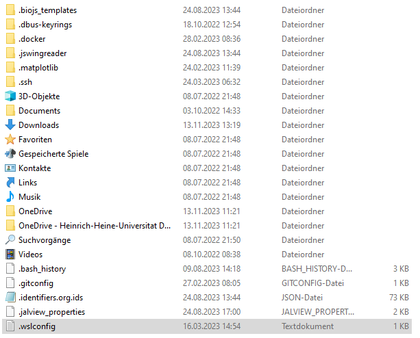
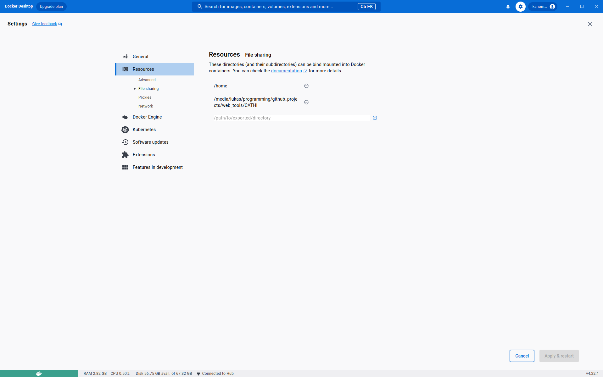
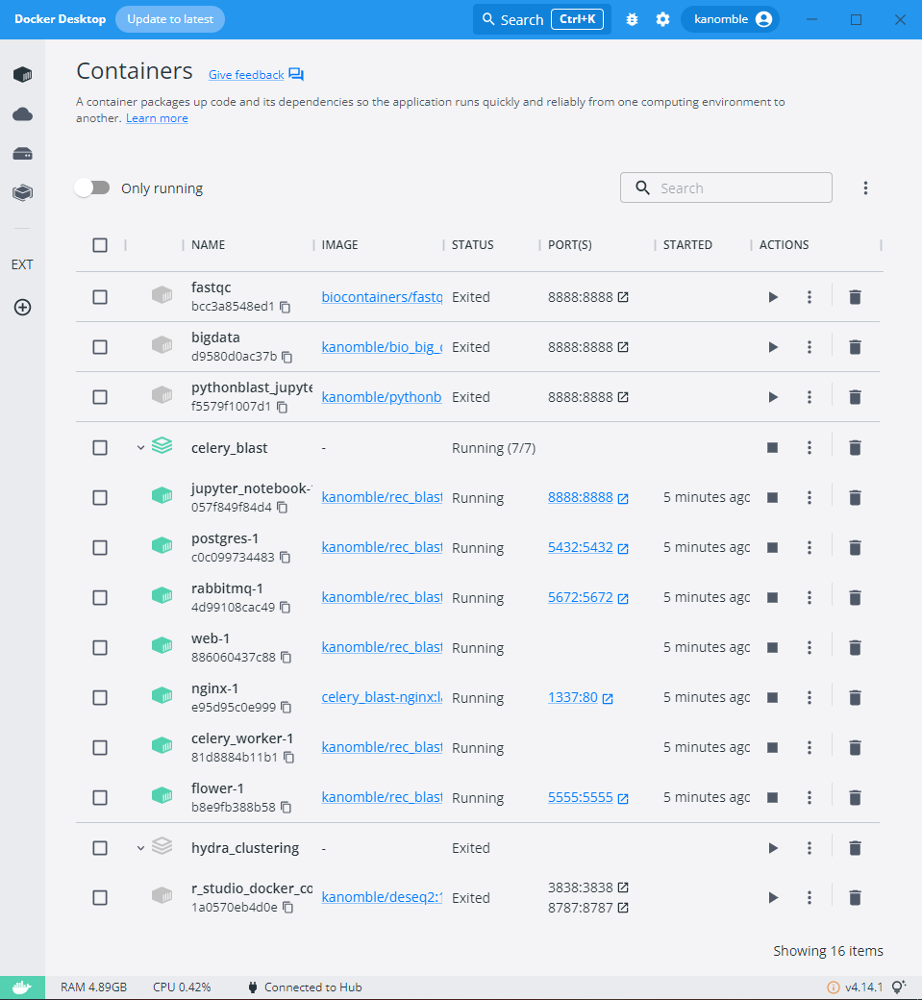
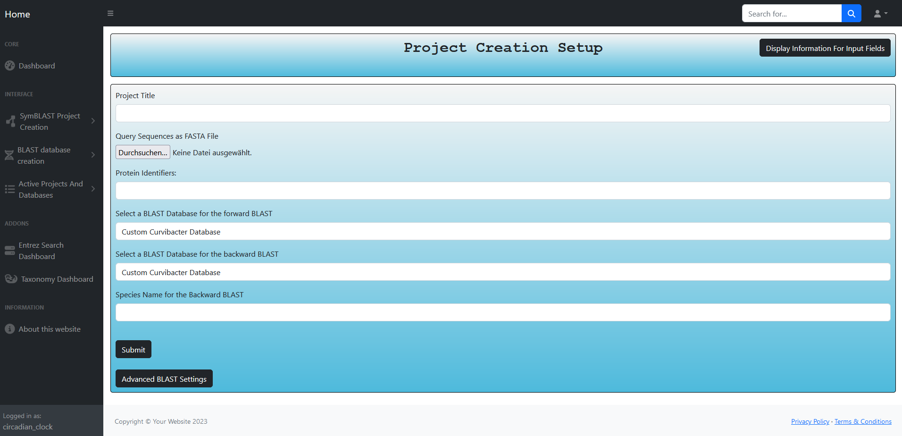
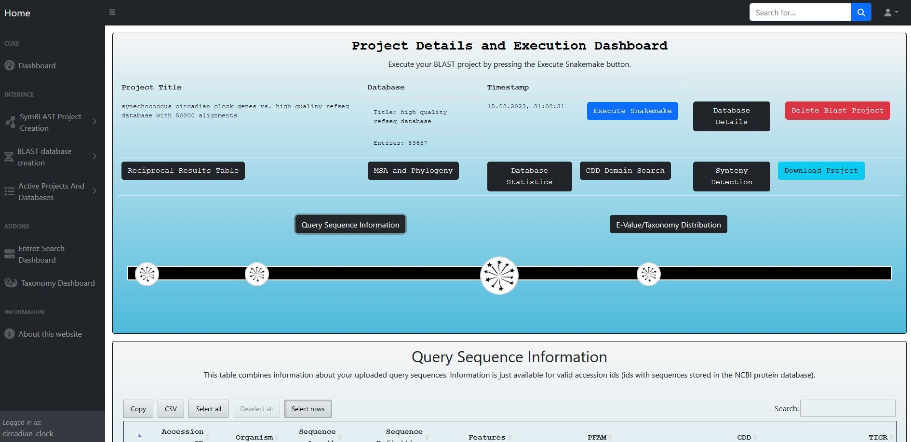
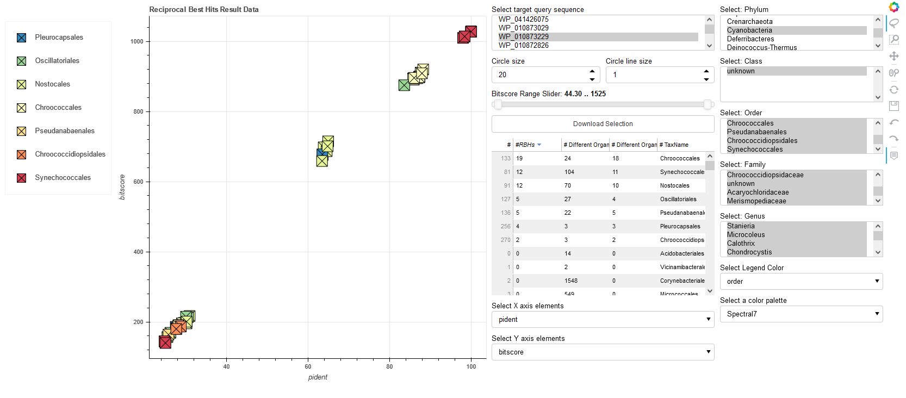
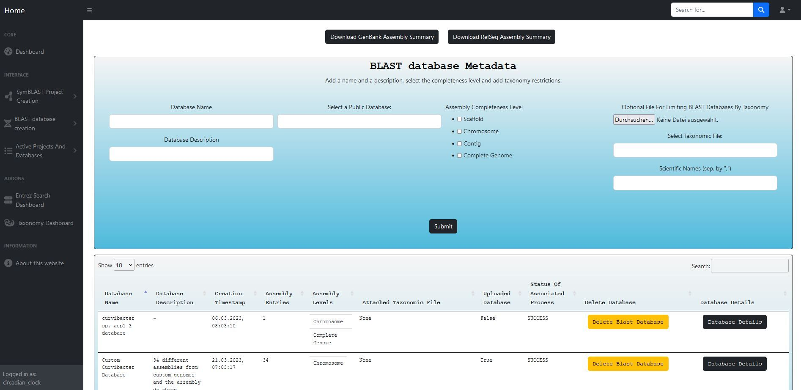
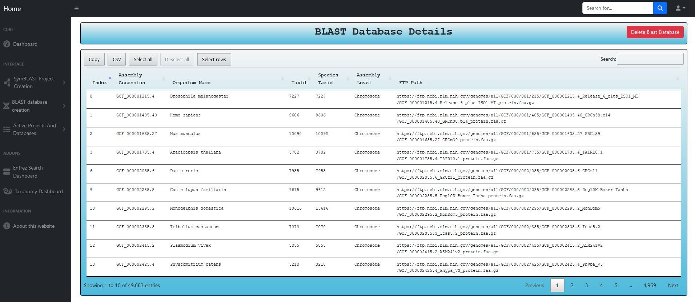

# NEWS

CATHI is now also available for remote reciprocal BLAST searches, without the need for downloading BLAST databases.
You just need to provide the backward BLAST genome, which is one protein FASTA file.

# Installation Issues

There might be some installation issues, if you need help to set up Docker and CATHI: write a mail to lukas.becker@hhu.de and we can arrange a meeting.
CATHI is still under development, any help is useful, so don't hesitate to write a mail.

Thanks!

# CATHI - An interactive platform for comparative genomics and homolog identification

Symmetrical BLAST and target sequence search web interface with Django, Gunicorn, Nginx, PostgreSQL, Celery, RabbitMQ, 
E-Direct, BLAST, Snakemake and Miniconda.

CATHI is a user-friendly bioinformatics tool that performs reciprocal BLAST searches, generates multiple sequence 
alignments, and builds phylogenetic trees. It is integrated with the workflow management system ``Snakemake`, providing a 
streamlined and efficient way to manage the entire bioinformatics pipeline. 
Furthermore, CATHI offers additional features that make it a powerful and flexible solution
for researchers across various fields. CATHI generates interactive plots and tables in standalone HTML documents, 
which enables users to visualize and analyze complex biological data easily. CATHI integrates the NCBI's EDirect tool, 
which allows for sequence and paper searches directly within the web interface. It also enables users to download 
taxonomic-specific protein sequences based on the results of their EDirect searches.

In addition, CATHI includes tools for managing local protein BLAST databases. Researchers can download and format custom 
databases, providing greater control and flexibility over the data used in their analyses. CATHI also includes 
a refined alignment and phylogenetic tree reconstruction process that leverages the protein domains of the CDD 
database using the RPS-BLAST tool. 

CATHI is highly sophisticated and powerful, offering a range of features and capabilities ideal for target sequence searches.
It enables performing reciprocal and one-way BLAST searches within local and remote 
databases, providing valuable insights into the evolutionary relationships and functional characteristics of sequences.
CATHI's integration into a Docker container network streamlines its installation process.

## Content
- [Installation](#installation)
  - [Requirements](#installation_requirements)
  - [Installation of CATHI](#installation_cathi)
  - [Advanced Installation](#configuration_notes)
- [How To Use CATHI](#project_setup)
  - [Example output](#example_output)
- [BLAST Database creation](#blast_database)
  - [Upload your own genome files](#genome_upload)
- [Technical Details](#technical_details)
  - [Notes on the download procedure](#download_process)
  - [Notes on the BLAST database formatting procedure](#makeblastdb)
- [ToDo's](#todo)

<a name="installation"></a>
## Installation

CATHI is distributed as a Docker Compose application. The default installation path uses the published CATHI application,
PostgreSQL, and RabbitMQ images. Building the application image locally is only needed for development or release work.

<a name="installation_requirements"></a>
### Requirements

- Docker Desktop or Docker Engine with the Compose v2 plugin (`docker compose`).
- Git, or a ZIP download of this repository.
- Enough local disk space for uploaded data, generated workflow outputs, BLAST databases, CDD data, and PostgreSQL data.
- On Linux hosts, writable `data` and `tmp` directories for the container runtime user `10001:10001`.

Docker Desktop can be downloaded from [docker.com](https://www.docker.com/products/docker-desktop/). On Windows with WSL2,
large BLAST workflows may need higher Docker memory and CPU limits. One option is to create a `.wslconfig` file in your
Windows user directory and restart Docker Desktop.



On macOS or Linux installations that use Docker Desktop, ensure the CATHI repository path is shared with Docker.



<a name="installation_cathi"></a>
### Installation of CATHI

Clone or download the repository, then enter the repository root:

```bash
mkdir CATHI
cd CATHI
git clone git@github.com:Kanomble/celery_blast.git
cd celery_blast
```

The repository root should contain files and directories such as `celery_blast`, `data`, `tmp`, `docker-compose.yml`,
`docker-compose-production.yml`, `Dockerfile`, `nginx`, `requirements.lock.txt`, `environment.yml`, and `README.md`.

#### 1. Create Runtime Environment Files

The checked-in `.env.*.example` files are templates. Copy them once, then edit the copied files for your machine or
deployment. The real `.env.*` files are intentionally untracked and must not be committed.

For local development, CATHI needs `.env.dev` for the application services and `.env.prod.db` for PostgreSQL:

```bash
cp .env.dev.example .env.dev
cp .env.prod.db.example .env.prod.db
```

On Windows PowerShell, use:

```powershell
Copy-Item .env.dev.example .env.dev
Copy-Item .env.prod.db.example .env.prod.db
```

For the production-style stack, also create `.env.prod`:

```bash
cp .env.prod.example .env.prod
```

On Windows PowerShell:

```powershell
Copy-Item .env.prod.example .env.prod
```

#### 2. Edit Required Settings

Before starting CATHI, edit the copied files:

- Set matching database values. In development, `SQL_DATABASE`, `SQL_USER`, and `SQL_PASSWORD` in `.env.dev` must match
  `POSTGRES_DB`, `POSTGRES_USER`, and `POSTGRES_PASSWORD` in `.env.prod.db`. In production, the matching application
  values live in `.env.prod`.
- Replace `SECRET_KEY` with a real secret value.
- For production, set `DJANGO_ALLOWED_HOSTS` and `CSRF_TRUSTED_ORIGINS` in `.env.prod` to the deployed host name and
  HTTPS origin.
- Review the reference-data URLs before running the CATHI setup procedure. The example files use NCBI HTTPS defaults;
  change them in `.env.dev` or `.env.prod` if your installation needs another mirror or pinned source:
  `TAXDB_URL`, `CDD_DATABASE_URL`, `REFSEQ_URL`, and `GENBANK_URL`.
- The CDD archive must be a readable `.tar.gz` file that contains `Cdd.pal`; the RefSeq and GenBank values should point
  to assembly summary text files.
- Keep `.env.dev`, `.env.prod`, and `.env.prod.db` out of Git. Do not commit runtime secrets.

Environment files are read when containers are created. If you change `.env.dev`, `.env.prod`, or `.env.prod.db` after
starting the stack, recreate the affected services so Docker Compose loads the new values.

#### 3. Prepare Writable Directories

On Linux hosts, prepare the writable runtime directories before starting the stack:

```bash
mkdir -p data tmp
sudo chown -R 10001:10001 data tmp
```

Docker Desktop on Windows and macOS usually handles these permissions through file sharing. Ensure the repository
directory is shared with Docker Desktop before starting the stack.

#### 4. Start Local Development

Start the Django development stack:

```bash
docker compose up
```

CATHI is then available at `http://127.0.0.1:8080/blast_project/`. Development Compose also binds PostgreSQL, RabbitMQ,
and Flower to loopback-only ports for local debugging. If you change `.env.dev` after the containers are running, recreate
the affected services so Docker Compose reloads the environment:

```bash
docker compose up -d --force-recreate web celery_worker celery_worker_interactive celery_worker_maintenance
```

#### 5. Start The Production-Style Stack

Start Nginx, Gunicorn/Django, Celery, PostgreSQL, and RabbitMQ:

```bash
docker compose -f docker-compose-production.yml up --build
```

CATHI is then available at `http://127.0.0.1:1337/blast_project/` unless the host port is changed in
`docker-compose-production.yml`. Production Compose publishes only the Nginx endpoint by default. PostgreSQL, RabbitMQ,
and Gunicorn/Django remain internal to the Compose networks. If you change `.env.prod` after startup, recreate the
application and worker services with the same Compose file so they receive the new values.

```bash
docker compose -f docker-compose-production.yml up -d --force-recreate web celery_worker celery_worker_interactive celery_worker_maintenance
```

Optional administrative services are disabled in production by default. To enable Flower or Jupyter for a trusted
maintenance session, first set `FLOWER_BASIC_AUTH` and `JUPYTER_TOKEN` in `.env.prod`, then run:

```bash
docker compose -f docker-compose-production.yml --profile admin up -d flower jupyter_notebook
```

Flower binds to `127.0.0.1:5555` and Jupyter binds to `127.0.0.1:8888`. Use VPN or SSH tunnels for remote
administration. See `docs/ADMIN_ACCESS.md`.

### Verification baseline

The supported Python version for repository-native checks is Python 3.8, matching the Miniconda runtime installed by the Dockerfile. Pull requests run a lightweight CI baseline that does not start the full production stack and does not download biological databases.

Local equivalents of the CI commands:

```` Bash
python -m pip install -r requirements.lock.txt
python scripts/check_dependency_locks.py
python scripts/check_docker_build_hardening.py
cd celery_blast
python manage.py check
python manage.py makemigrations --check --dry-run
python manage.py test --exclude-tag biological --exclude-tag external --exclude-tag docker --exclude-tag long
cd ..
python scripts/check_compose_exposure.py
python -m pip check
snakemake --version
docker compose config --quiet
docker compose -f docker-compose-production.yml config --quiet
````

Tests that require Docker, external services, large biological fixtures, or downloaded biological databases must be tagged with `docker`, `external`, or `biological` and are excluded from ordinary CI. Use placeholder environment values for local verification; production secrets must not be used in CI logs.

Production publishes only the Nginx endpoint by default. Flower and Jupyter are opt-in administrative services in the `admin` Compose profile, bind to loopback when enabled, and require runtime credentials. See `docs/ADMIN_ACCESS.md` for VPN and SSH-tunnel access guidance.

Current exclusions include database-statistics fixture tests, taxdb presence checks, hard-coded biological fixture path checks, and live Celery transaction tests. Run those tagged tests explicitly only in a prepared development or staging environment with the required small fixtures or services. Python dependencies are installed from `requirements.lock.txt`; Snakemake and Jupyter are installed from `environment.yml`. Dependency lock maintenance is documented in `docs/DEPENDENCIES.md`. Docker build policy, supported architecture, remote artifact downloads, and non-root runtime permissions are documented in `docs/BUILD_HARDENING.md`.

### Protected media

Project uploads, workflow outputs, logs, archives, result tables, and generated result images are protected artifacts. They must be linked through Django routes that verify the owning project and resolve files beneath the approved project directory. Production Nginx denies direct `/media/...` requests and exposes only the internal `/_protected_media/` location for Django-authorized `X-Accel-Redirect` responses. Set `PROTECTED_MEDIA_USE_X_ACCEL=true`, `PROTECTED_MEDIA_ROOT=/blast/reciprocal_blast/media`, and `PROTECTED_MEDIA_INTERNAL_URL=/_protected_media/` when serving protected large files through Nginx.

Remote BLAST Entrez queries are serialized with YAML-safe configuration updates and passed to BLAST as subprocess arguments, not shell text. Valid Entrez syntax may include spaces, brackets, parentheses, colons, quotes, Boolean operators, and Unicode text; control characters and line breaks are rejected with a validation error.

<a name="cathi_setup"></a>
### CATHI Setup

After CATHI starts, Docker Desktop or `docker compose ps` should show the web, worker, PostgreSQL, and RabbitMQ services
as running. The production stack also includes Nginx.



Next, register and log in to CATHI, then click **Start CATHI Tool Set-Up Procedure** on the home dashboard. This downloads
or refreshes the shared taxdb, Conserved Domain Database, RefSeq assembly summary, and GenBank assembly summary files from
the URLs configured in `.env.dev` or `.env.prod`.

Reference refreshes are staged and atomically activated. If a downloaded archive is unreadable, unsafe, empty, or missing
required files, the refresh fails and the previous active dataset remains in use.

<a name="configuration_notes"></a>
## Advanced Installation

CATHI uses published Docker images for the application, PostgreSQL, and RabbitMQ. The production Compose file builds the
small Nginx image locally from `nginx/Dockerfile`.

If you need to build or change the application image, update the Dockerfile and Compose image references deliberately.
The Dockerfile installs Python packages from `requirements.lock.txt` and Conda-managed tools from `environment.yml`.
Do not use `conda update --all` for runtime rebuilds. The application image is currently supported for `linux/amd64`
only because several upstream scientific tools are x86_64 Linux artifacts.

The Dockerfile downloads reviewed HTTPS remote artifacts and writes build metadata, including dependency versions and
principal tool versions. Run the local policy checks in `docs/BUILD_HARDENING.md` before submitting Dockerfile,
dependency, or remote artifact changes.

The current Compose services include `web`, three Celery worker queues (`celery_worker`, `celery_worker_interactive`, and
`celery_worker_maintenance`), `postgres`, `rabbitmq`, and, in production, `nginx`. Production-only admin services
`flower` and `jupyter_notebook` run only when the `admin` profile is enabled.

### Notes on CATHI containers and possible configurations
CATHI is a server site tool, by starting the container network, your local computer will be used as a web
server. `Django` is the underlying web-framework and `gunicorn` serves as the WSGI HTTP Server. Both applications reside
in the CATHI base image. `Nginx` is used as a reverse proxy server, it directs client requests to `gunicorn`.
The long-running background tasks are managed by `rabbitmq` and `celery`, thus triggered processes are picked up by 
the message broker `rabbitmq` and passed to a queue, if a `celery-worker` is free, the process is executed. The task progress
is saved within the `postgresql` database within the `django_celery_results_taskresult` table, which enables task monitoring.
The `flower` container can be used to monitor the `celery-worker`. The reciprocal BLAST pipeline and the normal 
one-way BLAST pipelines are integrated into a Snakefile, which is used by the workflow management system `snakemake`.
Customization of Snakefiles enables user defined post-processing. In addition, a `jupyter-notebook` container is
available through the optional admin Compose profile. Runtime configuration is done with local, untracked `.env.*` files
created from `.env.dev.example`, `.env.prod.example`, and `.env.prod.db.example`.
Set real runtime values before deployment; review the default reference-data URLs and change them if your deployment uses
other mirrors or pinned artifacts.
Secret rotation guidance is documented in `docs/SECRET_ROTATION.md`.

<a name="project_setup"></a>
## Project setup
To execute the integrated reciprocal BLAST pipeline of CATHI, certain data must be set up by the user. 
This includes the query sequences from a particular organism/genome file,
a forward BLAST database that will serve as the search space, a backward BLAST database, the scientific name of the 
organism from which the query sequences were obtained, and a project title. Additionally, the user can modify some BLAST
settings, such as the number of output sequences per query sequence (num_alignments) or the e-value cut-off. 
The BLAST databases can be selected from a special drop-down menu.

The forward BLAST database acts as a search space in which putative orthologous sequences can be located, 
while the backward BLAST database must contain the genome file from which the query sequences were obtained. 
Prior to saving a project into the database or executing the pipeline, the user-provided data undergoes validation to 
ensure that it meets the necessary criteria. If any of the validations fail,
accurate error messages are displayed within the relevant form fields to ensure a smooth pipeline execution.




The pipeline comprises the following steps:

1. Forward BLAST (default BLAST settings: e-value=0.001, word-size=3, threads=1, num_alignments=10000, max_hsps=500)
2. Backward BLAST preparation (extracting homologous target sequences of the forward BLAST)
3. Backward BLAST (BLAST search of the homologous target sequences against the genome of the query sequences)
4. Extracting Reciprocal Best Hits (RBHs, this is done via pandas merging tools)
5. Post-processing of RBHs (inference of taxonomic information, statistics, HTML and CSV tables, basic result plots)
6. Extraction of RBH-sequences separated by query sequences
7. Multiple sequence alignment of each set of RBHs with MAFFT
8. Phylogenetic inference of each set of RBHs with FastTree
9. Post-processing of the phylogenetic tree with ete3
10. CDD domain search of target sequences



Further CATHI post-processing procedures outside the scope of this pipeline involves:

1. Combining taxonomic information of the underlying database with the RBH result table
2. Building an interactive bokeh plot, that enables intuitive result interpretation
   1. Filter RBHs based on taxonomy, e-value, bitscore, sequence length and percent identity
   2. Download a selection of protein identifier
3. Refined phylogenetic inference with CDD domains of the RBHs
   1. Conducting RPS-BLAST with a specified set of RBHs
   2. Conducting a principal component analysis (PCA) based on the percent identity of the inferred domains with respect to the query sequence domains
   3. Building an interactive bokeh plot with the first two principal components and the taxonomic information within the RBH result table
   4. Refine the phylogeny by selecting RBHs directly from the PCA bokeh-plot to conduct a conserved-domain corrected phylogenetic inference
4. Synteny analysis
   1. Select up to ten different RBHs for the inference of syntenic regions with the clinker tool
   2. The clinker result is an interactive HTML document that can be changed according to user needs

Further CATHI target-sequence search features:

1. Target sequence search with NCBIs Entrez-Direct tool
   1. CATHI offers an interface that can be used to search within the PubMed, Protein, Pfam and Assembly NCBI databases
   2. Within comprehensive and interactive result tables users can download their seuqences of interest directly as protein FASTA files
<a name="example_output"></a>
### CATHI example output


The X and Y axes of the scatter plot are parameters of the dataset, such as bitscore, e-value, sequence identity (pident), and sequence lengths, enabling the
exploration of relationships among these RBHs. The interactivity of the scatter plot is facilitated by Bokeh, a powerful
visualization library. Users can dynamically manipulate the dataset through filtering options informed by the
taxonomic information associated with each RBH. In addition, Bokeh provides a lasso tool to select specific RBHs
within the graph. The lasso tool can be selected from the Bokeh tool-panel displayed at the right side of the figure.
This interactive feature empowers researchers to dissect real-time taxonomic trends and relationships among RBHs,
unveiling underlying patterns and insights.

### Best practices for project settings
Use appropriate BLAST databases. If you want to search in more complete genomes, create a database that contains genome sequences
with a completeness level of `Chromosome` or `Complete Genome`. The `e-value` is more accurate for bigger databases, adjust the 
`e-value` according to your needs, this may have a huge effect on your inferred RBHs. Adjust the `num_alignments` parameter if
you work with huge databases, especially if you are working with more common sequences. 

The backward BLAST database should contain only one genome that corresponds to the taxonomic unit translated provided scientific name.


<a name="blast_database"></a>
## BLAST Databases
## BLAST database preparation from GenBank or RefSeq assemblies
First, you need to tell CATHI to download the refseq or genbank assembly summary file from the
refseq [FTP](ftp://ftp.ncbi.nih.gov/genomes/refseq/) or genbank [FTP](https://ftp.ncbi.nlm.nih.gov/genomes/genbank/) directories.
The application loads the processed entries of the summary file into a pandas dataframe, 
that is displayed in the BLAST database transaction dashboard after pressing the submit button. Possible BLAST database user specifications are
the level of assembly completeness (e.g. 'Complete Genome', 'Chromosome', 'Contig' and 'Scaffold') 
and (multiple) taxonomic information (e.g. 'Cnidaria, Mammalia').



### Example database creation
E.g. if you want to create a high quality database containing only species from the phylum `Cyanobacteriota`, you have to specify 
this during database creation. This can be done by typing `Cyanobacteriota` into the field "Scientific Names (sep. by ",")" and by
checking the assembly levels `Complete Genome` and `Chromosome`. 

If the user submits the form, a `BlastDatabase` model instance and a 
database directory, with a csv file containing the database table, is created.
The model is saved into the database, the database is not downloaded and formatted directly. 
The download and formatting procedure has to be started separately, which enables the user to validate database entries.
The download and format process progression is visualized on the database dashboard.
Available databases are shared between users.




<a name="genome_upload"></a>
## Uploading genomes for BLAST database creation
The second option to obtain BLAST databases is to upload your own genomes. 
Currently, only genomes with protein sequences are supported. There are two different forms that can be used 
for uploading your own genome files.
1. The first form allows uploading a concatenated genome FASTA files with 
metadata file fields such as a taxmap file, which holds taxonomic information, an organism file, an assembly level file and
an assembly accession file. Most of these files are not mandatory. 
2. The other form allows uploading of multiple, single genome files together with their valid scientific organism names.


<a name="technical_details"></a>
## Technical Details
### Docker
All necessary software packages are deployed within docker container. Those containers are wrapped into a network
using Docker Compose.

### Django, Gunicorn and Nginx
Django, Gunicorn, and Nginx are commonly used technologies for building and deploying web applications. 
In a Docker network, these technologies can be used together to create a scalable and efficient web application stack.
Django is a popular Python-based web framework used for building web applications. 
Gunicorn is a Python WSGI HTTP server that can serve Django applications.
Nginx is a high-performance web server that can act as a reverse proxy, load balancer, and serve static files.
When using Django, Gunicorn, and Nginx in a Docker network, each technology can be run in a separate Docker container. 
The Django application can be run using Gunicorn as a WSGI HTTP server, while Nginx can be used as a reverse proxy to direct traffic to the appropriate container.
This setup can be scaled horizontally by adding more containers to handle increased traffic. 
In addition, Docker's networking features can be used to ensure that traffic is properly directed to the appropriate container.
Overall, using Django, Gunicorn, and Nginx in a Docker network can create a highly scalable and efficient web application stack.

### Distribution of background tasks with Celery
The open source tool celery is used to integrate a task queuing system within the django container. All background tasks are 
wrapped into celery tasks. Celery enables task distribution across threads which enables the simultaneous processing of various reciprocal or one-way BLAST
projects. The celery worker process is triggered in the `celery_worker` container, tasks can be monitored via dedicated web-interfaces or within this
container. Accurate log-messages are displayed within the terminal window of the `celery_worker` container. Celery tasks are saved 
in the `PostgreSQL` database by using the `TaskResult` model instance of the `django_celery_results` django application 
(installed via the python package `django-celery-results`). Detailed information about Celery can be found on the official 
[project documentation page](https://docs.celeryq.dev/en/stable/index.html).

### Snakemake pipeline
In order to enable reproducibility and an easy-to-use workflow execution, the workflow engine snakemake is used.
Snakemake associated snakefiles reside in a static directory `celery_blast/celery_blast/static/snakefiles`. 
They can be used outside this application, e.g. if the researcher needs to use additional settings or want to implement own post-processing procedures.
Different snakefiles are designed to execute the desired workflows. 
Currently, there are Snakefiles for the One-Way BLAST remote and local searches and the reciprocal BLAST analysis.
Execution of snakemake is wrapped in functions within the `tasks.py` files,
which are decorated with the celery `@shared_task` decorator. Those functions are queued up by rabbitmq and are processed by the celery worker.
Snakemake is executed with the `subprocess.Popen` interface which spawns a child process for every Snakemake workflow. 
Snakemake's working directory is the current project directory, e.g. if you executed the snakemake pipeline for a reciprocal BLAST
project, the `CWD` of snakemake is the path that points to this project. Default project paths are defined in the `celery_blast/settings.py` file.

Detailed information about Snakemake can be found on the [project documentation page](https://snakemake.readthedocs.io/en/stable/).

### PostgreSQL database models
Django models reside inside project specific `models.py` files. Models are translated to database tables.
Documentation about the django.db.models package can be found [here](https://docs.djangoproject.com/en/2.2/topics/db/models/).
Relationships between models are managed with django model functions.
The `models.ForeignKey()` function is used for OneToMany / ManyToOne relations.
Additionally, there are the `models.OneToOneField()` and `models.ManyToManyField()` functions.
Relationships can get further described with `related_name` and `related_query_name` parameters, described in
[this](https://docs.djangoproject.com/en/2.2/ref/models/fields/#django.db.models.ForeignKey.related_query_name) Django documentation section.

Model managers reside inside project specific `managers.py` files.
Manager classes are responsible for the initial creation of the database models, such as `create_blast_project(fields=values ...)`.
Those functions can be used to trigger side effects during initialization of the database entry.
E.g. creation of blast project directories or specific setting files, such as the snakemake configuration file.

<a name="download_process"></a>
### Download and formatting procedure of genome assemblies
When the user clicks the download button, a celery asynchronous task is initiated. 
This task consists of multiple subtasks, each responsible for performing specific steps in the database creation process. 
Celery allows for task monitoring through a logger and the ``TaskResult`` model of the [result backend](https://docs.celeryproject.org/en/stable/userguide/tasks.html#task-result-backends).

The task is triggered by a function called ``download_blast_databases_based_on_summary_file``
in the ``refseq_transactions/tasks.py`` file, which has three main steps. Firstly, it attempts to download and decompress 
all files stored in a table created during ``BlastDatabase`` model creation (as described in the above section). 
The celery task then formats the downloaded protein fasta files into BLAST databases and generates
an alias file similar to the one created with the ``blastdb_aliastool``. 
All three main steps are performed using the ``subprocess.Popen`` interface.

In the first step, the Unix commands ``wget`` and ``gzip`` are used to download and simultaneously 
decompress genome assemblies from the NCBI FTP server. This is accomplished with the following command: 
``wget -qO- ftp_path | gzip -d > assembly_file.faa``. 
If this command produces an error (returncode != 0), it is retried up to a maximum of ten times. 
If the command still fails after ten attempts, the assembly file is skipped and removed from the csv table, 
the FTP path pointing to the file is written to a logfile.
Finally, in the next step, ``makeblastdb`` is used to format the downloaded and decompressed assembly files into BLAST databases.


<a name="makeblastdb"></a>
#### Notes on the `makeblastdb` program and BLAST database formatting
The ``makeblastdb`` module is a useful tool for building custom BLAST databases.
By default, it creates a database based on the input sequences. 
For example, if you submit the following command: ``makeblastdb -in .\prot_1_db.faa -dbtype prot -taxid 1140 -blastdb_version 5``,
a database named bw_prot_db.faa will be created. 
The ``-taxid`` parameter is used to assign the taxonomic node 1140 (corresponding to Synechococcus elongatus 7492) 
to all sequences in the bw_prot_db.faa fasta file.
If you need to format multiple fasta files using the ``makeblastdb`` program, there are two options available. 
First, you can provide multiple fasta files to the ``-in`` parameter. 
Alternatively, after formatting each fasta file individually, you can create a ``.pal`` database alias file that lists 
all existing databases. The ``blastdb_aliastool`` program can also be used to create this alias file for you.
If the sequences in the fasta files have the same taxonomic node, you can use the ``-taxid`` parameter to assign the taxid to the program. 
However, if they have different taxonomic nodes, you should use the ``-taxid_map`` parameter instead.

```` Bash
makeblastdb -in .\prot_1_db.faa -dbtype prot -taxid 1140 -blastdb_version 5
makeblastdb -in .\prot_2_db.faa -dbtype prot -taxid 1844971 -blastdb_version 5
blastdb_aliastool -dblist 'prot_1_db.faa prot_2_db.faa' -dbtype prot -title combined_db -out combined_db
blastp -query .\test.faa -db combined_db -out blast_out.table -outfmt "6 qseqid sseqid evalue bitscore qgi sgi sacc pident nident mismatch gaps qcovhsp staxids sscinames scomnames sskingdoms  stitle"
````
BLASTP `-outfmt 6` output formats are described [here](http://www.metagenomics.wiki/tools/blast/blastn-output-format-6).

The third step creates an alias file for all BLAST databases that have been formatted in the previous step.
The alias file is the file, that is created by the `blastdb_aliastool`.

Example of the `combined_db.pal` file:
````Text
#
# Alias file created 04/17/2021 12:50:29
#
TITLE combined_db
DBLIST "prot_1_db.faa" "prot_2_db.faa"
````
The `.pal` file combines different formatted BLAST databases so that they can be used as one combined database. 
This is useful for databases with duplicate sequences, they normally have an identifier (accession number) that starts with `WP`.

During execution the underlying database (e.g. `BlastDatabase` or `BlastProject`) model OneToOne field gets updated with the appropriate celery `TaskResult` model.
This allows interaction with the associated celery task and can be used for displaying the progress of the task.

<a name="todo"></a>
## TODO
- [ ] fix error in domain corrected phylogeny
  - the target sequence may not be part of the dataframe for the construction of phylogenies
- [ ] add ajax calls to CDD search ...
- [ ] add capitalize or something similar to name validations
- [ ] fix correct error displaying if there are no results in a reciprocal BLAST search
  - [ ] add warning during project creation if in the database reside more than one organism with the specified taxid
- [ ] fix evalue in axis changing within bokeh plots
- [ ] refactor calculation of database normalized tables
  - seems to be zero in some cases (which is wrong)
- [ ] add validation for entrez_queries
- [ ] add videos, links to init page
- [ ] add setup option after installation -> directly download CDD/refseq/genbank assembly summary files (maybe add a wizard)
- [ ] add error message if filtered database table is empty

## useful documentation:
- Interaction with NCBI (Entrez) via python [Biopython package](https://biopython.org/wiki/Documentation)
- [Celery Project Documentation](https://docs.celeryproject.org/en/stable/django/first-steps-with-django.html)
- Documentation for [snakemake](https://snakemake.readthedocs.io/en/stable/index.html)
- Documentation for [celery-progress](https://github.com/czue/celery-progress) - youtube tutorial [celery-progress](https://www.youtube.com/watch?v=BbPswIqn2VI)
- [BLAST DB](https://ftp.ncbi.nlm.nih.gov/blast/documents/blastdb.html) FTP server description
- Documentation for the [E-Direct](https://www.ncbi.nlm.nih.gov/books/NBK179288/) tool
